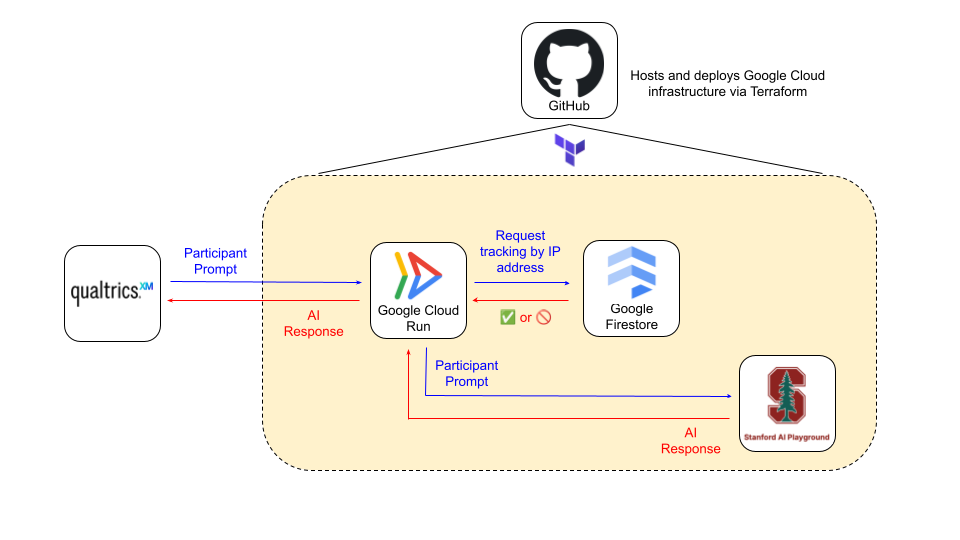

# Stanford GSB Qualtrics AI Chatbot

This guide walks you through setting up an AI chatbot within a Qualtrics survey, powered by a backend built in Google Cloud and LLMs provided by Stanford AI Playground. This implementation is currently being used by the [Stanford GSB Behavioral Lab](https://www.gsb.stanford.edu/faculty-research/behavioral-lab).

A presentation on this implementation was given on February 18, 2026 as a Hub How-To titled AI Integration in Qualtrics.
- Zoom Recording
- Slides

---

## What This Repository Does

This repository creates a secure "middle-man" (proxy) within Google Cloud between your Qualtrics surveys and Stanford's AI Playground API. As a result of this infrastructure:
- Your API keys stay hidden (never exposed in survey code)
- You get security controls within the Google Cloud proxy such as rate and volume limits based on IP address
- You can perform one-click deployments to generate Qualtrics survey questions with an AI chatbot and to build the Google Cloud proxy infrastructure

---

## What You Will Need Before Starting

1. **Stanford Google Cloud account** with a valid Project-Task-Award (PTA) -- [File UIT Request Here](https://stanford.service-now.com/it_services?id=sc_cat_item&sys_id=fa9f80bddbf05b401df130cf9d96198b)
2. **GitHub account** to clone this repository
3. **Stanford AI Playground API Key** (starts with `sk-...`) -- [File UIT Request Here](https://stanford.service-now.com/it_services?id=sc_cat_item&sys_id=fd75ec563b90265079a53434c3e45a65)
4. **Stanford Qualtrics account** with API access enabled -- [Set up Qualtrics Account Here](https://uit.stanford.edu/qualtrics/account)

---

## Phase 1: Google Cloud Setup ☁️

### Step 1.1 — Create a Stanford Google Cloud Project

1. File a Stanford UIT request [here](https://stanford.service-now.com/it_services?id=sc_cat_item&sys_id=fa9f80bddbf05b401df130cf9d96198b), with a valid Stanford Project-Task-Award (PTA) in hand. Fill out an appropriate Project Name, which will be used later.
2. Once created, navigate to the [Google Cloud Console](https://console.cloud.google.com/welcome?) and **write down your Project ID**. You can find it on the console page in the upper-left hand corner and it looks something like `gsb-[project_name]`. You will need this later.

### Step 1.2 — Create a Service Account (the "Robot" that deploys for you via GitHub)

GitHub Actions needs permission to manage resources in your Google Cloud project. You do this by creating a "service account." This account will also automatically enable all the required Google Cloud APIs for you during deployment.

1. In the Google Cloud Console, go to **IAM & Admin** > **Service Accounts**
2. Click **+ Create Service Account**
3. Fill in:
   - **Name:** `github-deployer`
   - **Description:** "Used by GitHub Actions to deploy infrastructure"
4. Click **Create and Continue**
5. Under **Grant this service account access to project**, you need to add **4 roles**. Click the Role dropdown and add each one (use the **+ Add Another Role** button after each):

   | # | Role | Why it's needed |
   |---|------|-----------------|
   | 1 | **Editor** | Manages Cloud Functions, Cloud Storage, Cloud Run, and most other resources |
   | 2 | **Service Usage Admin** | Allows Terraform to automatically enable all required Google Cloud APIs |
   | 3 | **Security Admin** | Allows Terraform to set the IAM policy that makes your proxy publicly accessible |
   | 4 | **Cloud Datastore Owner** | Allows Terraform to create and manage the Firestore database used for rate limiting |

6. Click **Continue**, then **Done**
7. Now you need to create a key for this account:
   - Click on the service account you just created (`github-deployer`)
   - Go to the **Keys** tab
   - Click **Add Key** > **Create new key**
   - Select **JSON** and click **Create**
   - **A file will download to your computer. Keep this file safe — you will need its contents in the next phase.**

---

## Phase 2: Gather Your Qualtrics Information 📝

You will need two pieces of information from Qualtrics.

### Step 2.1 — Find Your API Token

1. Log into [Qualtrics](http://stanforduniversity.qualtrics.com/)
2. Click your profile icon (top right) > **Account Settings**
3. Go to the **User Settings** section
4. Find and copy your **API Token**
   - If you don't see one, click **Generate Token**

### Step 2.2 — Find Your Data Center

1. On the same **User Settings** page, look at your **User** section
2. Your data center is the subdomain in your Qualtrics URL (e.g. if your URL is `https://yul1.qualtrics.com`, your data center is `yul1`)

---

## Phase 3: GitHub Actions Setup :octocat:

Two deployment workflows will be created in this phase:
- **Build Qualtrics Survey** -- Create Qualtrics questions with AI chatbot implemented
- **Terraform Deploy** -- Build and update Google Cloud proxy infrastructure

### Step 3.1 — Fork This Repository

1. Go to this project's GitHub page
2. Click **Fork** (top right) to create your own copy. Alternatively, create a new private repository and push the code there.

### Step 3.2 — Add Repository Variables and Secrets

Use **Variables** for non-sensitive configuration and **Secrets** for sensitive credentials/tokens. Both are passed to workflows at runtime.

1. In your GitHub repository, go to **Settings** (tab at the top)
2. In the left sidebar, click **Secrets and variables** > **Actions**
3. Add the following **Variables** and **Secrets**:

| Type | Name | What to Enter | Purpose / Used by |
|------|------|---------------|-------------------|
| Variable | `TF_STATE_BUCKET` | A unique bucket name for storing Terraform deployment state. Use your Project ID followed by `-tfstate` (e.g. `gsb-[project_name]-tfstate`). | **Both workflows.** Points Terraform at the Google Cloud Storage bucket that stores infrastructure state and retrieves Google Cloud Run URL for Qualtrics survey question. Auto-created if missing. |
| Variable | `GCP_PROJECT_ID` | Your Google Cloud Project ID from Step 1.1 (e.g. `gsb-[project_name]`) | **Terraform Deploy.** Identifies which Google Cloud project to deploy into. |
| Variable | `QUALTRICS_DATA_CENTER` | Your Qualtrics data center from Step 2.2 (e.g. `yul1`) | **Build Qualtrics Survey.** Used to construct the Qualtrics API base URL. |
| Secret | `GCP_CREDENTIALS` | Open the JSON key file from Step 1.2 in a text editor (like Notepad or TextEdit). **Copy and paste the ENTIRE contents** of the file. | **Both workflows.** Authenticates GitHub Actions to Google Cloud. |
| Secret | `STANFORD_API_KEY` | Your Stanford AI Playground API key (starts with `sk-...`) | **Terraform Deploy.** Injected as a Google Cloud Run environment variable; used at runtime to call the Stanford AI Playground API. |
| Secret | `QUALTRICS_API_TOKEN` | Your Qualtrics API token from Step 2.1 | **Build Qualtrics Survey.** Authenticates the build script against the Qualtrics API. |a
| Secret | `ENDPOINT_KEY` | The special key used to access your Google Cloud Run endpoint from Qualtrics. Optional. | **Both workflows.** Injected as a Google Cloud Run environment variable for optional request authentication and into the Qualtrics survey as an Embedded Data field. Currently disabled. |
| Secret | `ALLOWED_ORIGINS` | The Qualtrics URLs that are allowed to call your proxy, separated by commas. For most Stanford users, the default works. Example: `https://{SCHOOL}.qualtrics.com` | **Terraform Deploy.** Injected as a Google Cloud Run environment variable; the proxy checks request origins against this list. |

> **Important:** Double-check each variable/secret for typos. A wrong value here is large cause of deployment failures.

When you're done, you should see all 8 entries saved (3 Variables and 5 Secrets).

---

## Phase 4: Deploy Google Cloud Infrastructure 🚀

This step builds all of the Google Cloud resources (the proxy function, database, storage, etc.).

1. In your GitHub repository, click the **Actions** tab at the top
2. In the left sidebar, click **Terraform Deploy**
3. On the right side, click the **Run workflow** dropdown
4. Make sure the branch is set to `main`
5. Click the green **Run workflow** button
6. Wait for the workflow to complete (this takes 3-5 minutes)
   - You'll see a spinning yellow circle while it runs
   - When done, it will show a green checkmark (success) or a red X (failure)
   - The run also writes a short **Terraform Deploy Summary** with high-level outcomes

> **Note:** If this is your *very first time* running the **Terraform Deploy** workflow, you may get a failure resulting from the amount of time it takes for the various Google Cloud APIs to be enabled and propagated across your account. If this happens, simply run the workflow again and it should be successful.

### If deployment fails:
- Click on the failed workflow run to see which step failed
- Common issues:
  - **Authentication error:** Double-check your `GCP_CREDENTIALS` secret — make sure you pasted the *entire* JSON file
  - **API not enabled:** Make sure your service account has the **Service Usage Admin** role (Step 1.2). Terraform enables APIs automatically, but needs this permission to do so.
  - **Bucket name taken:** Change your `TF_STATE_BUCKET` variable to a different unique name
  - **API enabling has not propagated:** If this is your very first time running the workflow, all of the Google Cloud APIs are enabled from scratch and may not propagate in time for the rest of the Terraform plan to be executed. Simply run again.

---

## Phase 5: Build Your Qualtrics Survey 🛠️

This step creates (or updates) a Qualtrics survey that is wired up to your AI proxy. Each workflow run adds **one chat question** to a survey. You can run it multiple times with different question names to add multiple AI chat questions to the same survey — each with its own model, prompt, and settings.

1. In your GitHub repository, click the **Actions** tab
2. In the left sidebar, click **Build Qualtrics Survey**
3. Click the **Run workflow** dropdown
4. Fill in the options:

| Field | What It Means | Suggested Value |
|-------|--------------|-----------------|
| **Survey name** | The name that will appear in Qualtrics | e.g. `My AI Chatbot Study` |
| **Question name** | A unique name for this chat question. Use a different name for each AI chat you want in the survey. | e.g. `Chat_GPT4` or `Chat_Mini` |
| **System prompt** | Instructions that tell the AI how to behave for this question | e.g. `You are a helpful research assistant` |
| **Select LLM Model** | Which Stanford AI Playground model to use for this question (dropdown) | `gpt-4o` is recommended |
| **Model temperature** | How creative the AI is for this question (0 = focused, 2 = very creative) | `1` is a good default |
| **Max response tokens** | Maximum length of AI responses for this question | `1000` is a good default |
| **Max user conversation turns** | How many back-and-forth messages are allowed for this question | `99` for unlimited-feeling, or a smaller number to cap it |
| **Seconds per word of delay** | How many seconds of delay (per word) before showing bot response | `0` for instant, or a slightly larger number like `0.05` to slow the response |

5. Click the green **Run workflow** button
6. Wait for completion (1-2 minutes)
7. Review the **Build Qualtrics Survey Summary** for high-level run status
8. When done, log into Qualtrics — your new survey (or updated question) should be there!

### Adding Multiple AI Chat Questions to One Survey

You can add as many chat questions as you want to a single survey. Just run the workflow again with the **same survey name** but a **different question name**. For example:

- **Run 1:** Survey = `My Study`, Question = `Chat_GPT4`, Model = `gpt-4o`, Prompt = "You are a helpful assistant"
- **Run 2:** Survey = `My Study`, Question = `Chat_Mini`, Model = `gpt-4o-mini`, Prompt = "You are a concise assistant"

Each question gets its own model, prompt, temperature, token limit, and conversation limit. Chat histories are saved separately per question (e.g. `chat_history_Chat_GPT4`, `chat_history_Chat_Mini`).

> **Important:** If your survey has multiple chat questions, make sure each one is on its own page in Qualtrics (this is the default). Having two chat questions on the same page is not supported.

### Updating an Existing Question

To change the model or prompt for an existing question, run the workflow again with the **same survey name and question name** but different settings. It will update the existing question's configuration without creating a duplicate.

---

## You're Done! 👏

Your setup is now:
- **Qualtrics survey** sends user messages to your **Google Cloud Run proxy**
- The proxy securely forwards them to **Stanford's AI Playground API**
- Responses flow back to the survey participant
- Each chat question can use a different model, prompt, and settings

---

## Common Tasks After Setup

### Re-run the survey builder with different settings
Just repeat Phase 5 with new values. Use the same question name to update an existing question, or a new question name to add another chat question to the survey.

### Turn off the proxy (to save money)
If you're not actively running a study, you can disable the proxy so it costs nothing:
1. In the file `terraform/main.tf`, find the line `SERVICE_ENABLED = "true"`
2. Change it to `SERVICE_ENABLED = "false"`
3. Commit and push the change
4. Re-run the **Terraform Deploy** workflow (Phase 4)
5. The proxy will now reject all requests instantly (no AI API costs)

To turn it back on, change it back to `"true"` and re-deploy.

### View logs for debugging
1. In `terraform/main.tf`, change `ENABLE_LOGGING` from `"false"` to `"true"`
2. Commit, push, and re-run **Terraform Deploy**
3. Go to [Google Cloud Console](https://console.cloud.google.com/) > **Cloud Functions** > click your function > **Logs**

### Temporarily enable verbose workflow diagnostics
Use this only when troubleshooting workflow failures:
1. In GitHub Actions, open the workflow's **Run workflow** form
2. Check the **Enable verbose diagnostics in logs** box
3. Run the workflow and review detailed logs
4. Uncheck the **Enable verbose diagnostics in logs** box for routine runs to keep logs sanitized

### Update your API key or other config values
1. Go to your GitHub repo > **Settings** > **Secrets and variables** > **Actions**
2. Click the pencil icon next to the variable or secret you want to change
3. Enter the new value and save it
4. Re-run the **Terraform Deploy** workflow for changes to take effect

---

## Troubleshooting

| Problem | Solution |
|---------|----------|
| Terraform workflow fails at "Authenticate to Google Cloud" | Your `GCP_CREDENTIALS` secret is wrong. Re-copy the entire JSON key file contents. |
| Terraform fails at "Terraform Apply" with API errors | Make sure your service account has all 4 roles from Step 1.2 — especially **Service Usage Admin**, which allows APIs to be enabled automatically. |
| Qualtrics build fails at "Fetch Proxy URL" | The Terraform workflow hasn't been run yet, or it failed. Complete Phase 4 first. |
| Survey works but AI doesn't respond | Check that `SERVICE_ENABLED` is `"true"` in `terraform/main.tf`. Also verify your `STANFORD_API_KEY` is valid. |
| "Unauthorized Access" error in survey | Your Qualtrics survey URL isn't in the `ALLOWED_ORIGINS` secret. Add it and re-deploy. |
| "Too many requests" error | The rate limiter is blocking repeated requests from the same IP. Wait a moment, or adjust `ip_rate_limit` / `ip_max_calls` in `terraform/variables.tf`. |

---

## Need Help?

If you're stuck, [create an issue](https://github.com/gsbdarc/gsb-qualtrics-ai-chatbot/issues/new/choose) and provide the following:
1. Which **Phase/Step** you're on
2. A **screenshot** of the error (from GitHub Actions logs or Google Cloud Console)
